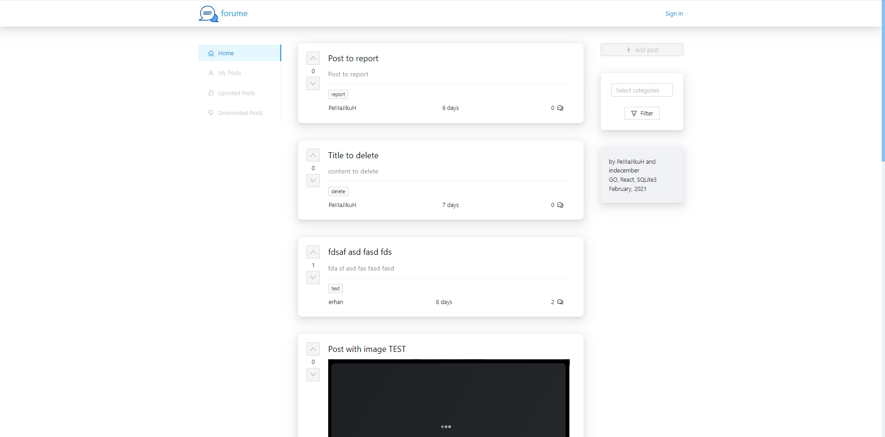
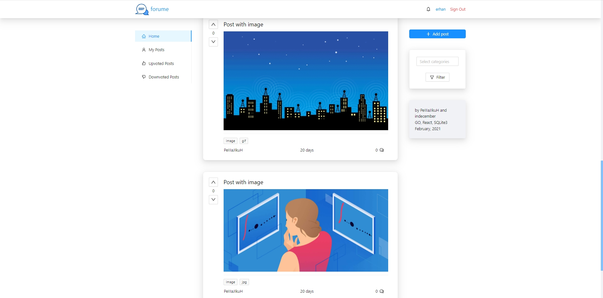
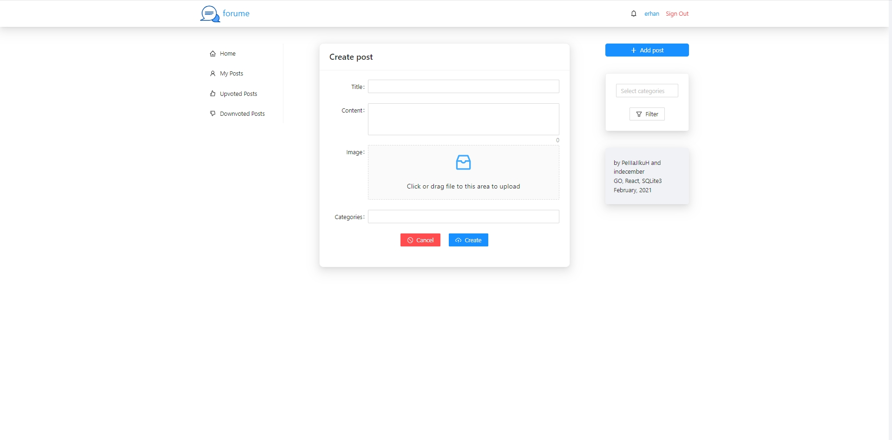
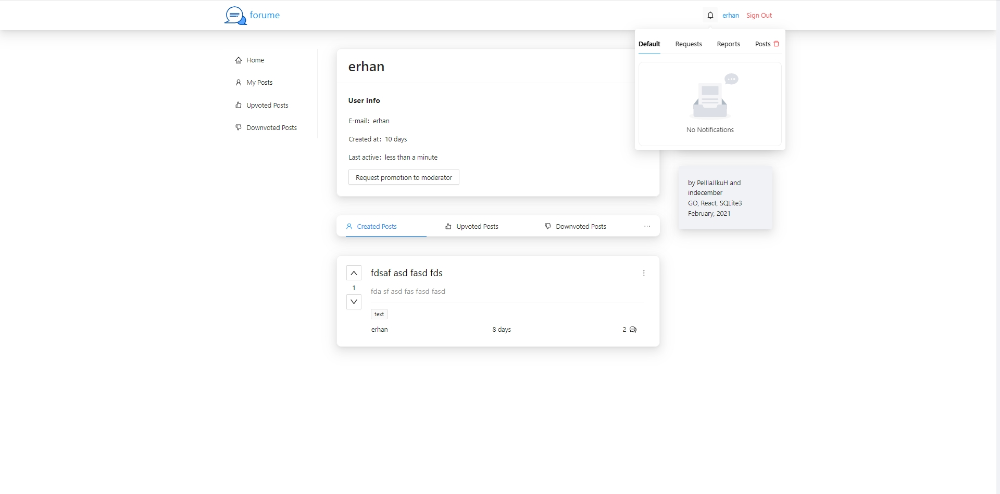
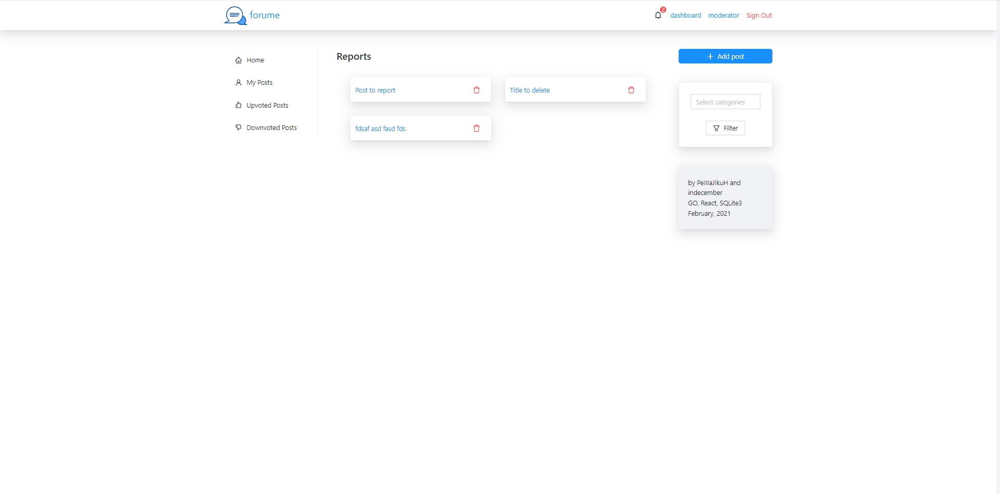
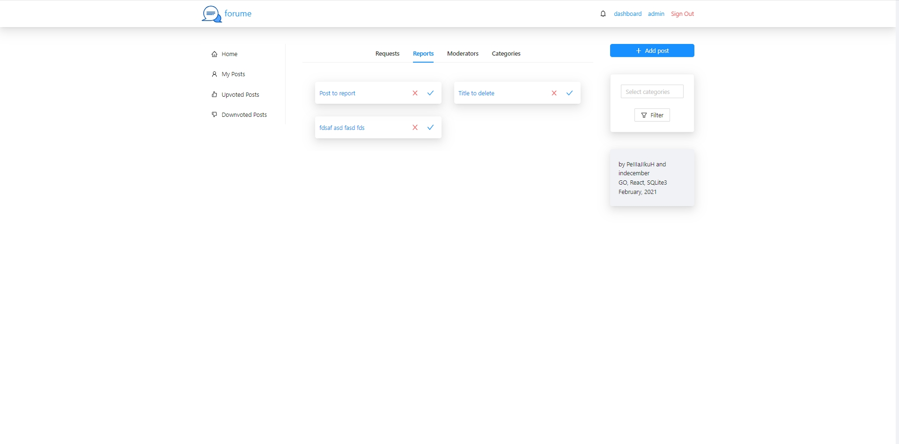

# Forum

* Frontend application for [backend](https://github.com/innovember/forum)

## Installing SSL keys

- This project requires connection using ssl keys.
- You must generate your own ssl cert and key in the {root}/ssl directory.
- If needed, change cert name and key name in vite.config.ts file.

## Backend starting

- Go to the link given above, clone the repo and run the backend server.

## Frontend starting

- Forum requires [Node.js](https://nodejs.org/) to run.
- Make sure that you have the latest LTS version of node.
- Open a terminal instance in the root folder:

```sh
npm i
npm start
```

## Screenshots

- App preloader
  
- Main page, user is not logged in
  
- Main page, user is logged in
  
- Create post form
  
- User page and notifications
  
- Moderator dashboard
  
- Admin dashboard
  
